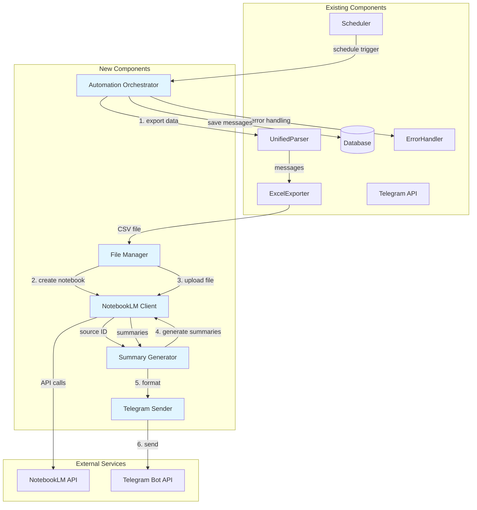
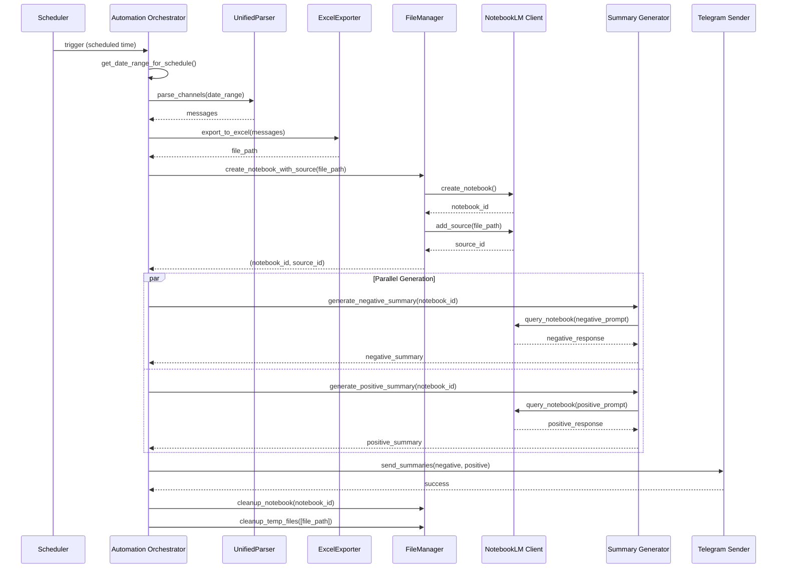

# Design Document: NotebookLM Telegram Automation

## Overview

Система автоматизации создания аналитических сводок через NotebookLM с последующей отправкой результатов в Telegram представляет собой интеграционное решение, которое объединяет существующий Telegram-парсер с возможностями AI-анализа NotebookLM.

### Цель системы

Автоматизировать ежедневный процесс анализа сообщений из Telegram-каналов, который в настоящее время выполняется вручную:
1. Экспорт данных из Telegram-парсера
2. Загрузка данных в NotebookLM
3. Генерация негативных и позитивных аналитических сводок
4. Отправка сводок в Telegram чат

### Ключевые принципы дизайна

- **Интеграция с существующей кодовой базой**: Максимальное переиспользование существующих компонентов (UnifiedParser, ExcelExporter, Database, ErrorHandler, Scheduler)
- **Модульность**: Четкое разделение ответственности между компонентами
- **Отказоустойчивость**: Retry-логика, обработка ошибок, очистка ресурсов
- **Асинхронность**: Параллельная генерация сводок для оптимизации времени выполнения
- **Конфигурируемость**: Все параметры (промпты, таймауты, расписание) настраиваются через конфигурационные файлы

## Architecture

### Архитектурная диаграмма



### Архитектурные слои

1. **Orchestration Layer** (Automation_Orchestrator)
   - Координация всего процесса
   - Управление жизненным циклом
   - Обработка ошибок на верхнем уровне

2. **Integration Layer** (NotebookLM_Client, Telegram_Sender)
   - Взаимодействие с внешними API
   - Retry-логика
   - Обработка специфичных ошибок API

3. **Business Logic Layer** (Summary_Generator, File_Manager)
   - Генерация сводок
   - Управление файлами и ноутбуками
   - Форматирование данных

4. **Data Layer** (UnifiedParser, Database, ExcelExporter)
   - Получение данных из Telegram
   - Хранение сообщений
   - Экспорт в различные форматы

## Components and Interfaces

### 1. NotebookLM_Client

**Ответственность**: Инкапсуляция взаимодействия с NotebookLM API через библиотеку notebooklm-py.

**Интерфейс**:

```python
class NotebookLMClient:
    """Клиент для взаимодействия с NotebookLM API"""
    
    def __init__(self, credentials: Dict[str, str]):
        """
        Инициализация клиента
        
        Args:
            credentials: Словарь с учетными данными (api_key, etc.)
        
        Raises:
            AuthenticationError: При невалидных учетных данных
        """
        pass
    
    async def create_notebook(self, title: str) -> str:
        """
        Создает новый ноутбук
        
        Args:
            title: Название ноутбука
        
        Returns:
            ID созданного ноутбука
        
        Raises:
            NotebookLMAPIError: При ошибке API
        """
        pass
    
    async def add_source(
        self, 
        notebook_id: str, 
        file_path: str, 
        file_type: str
    ) -> str:
        """
        Добавляет источник данных в ноутбук
        
        Args:
            notebook_id: ID ноутбука
            file_path: Путь к файлу
            file_type: Тип файла ('csv' или 'json')
        
        Returns:
            ID источника данных
        
        Raises:
            NotebookLMAPIError: При ошибке API
            FileNotFoundError: Если файл не найден
        """
        pass
    
    async def query_notebook(
        self, 
        notebook_id: str, 
        prompt: str, 
        timeout: int = 120
    ) -> str:
        """
        Отправляет запрос к ноутбуку
        
        Args:
            notebook_id: ID ноутбука
            prompt: Текст промпта
            timeout: Таймаут в секундах
        
        Returns:
            Текст ответа от NotebookLM
        
        Raises:
            TimeoutError: При превышении таймаута
            NotebookLMAPIError: При ошибке API
        """
        pass
    
    async def delete_notebook(self, notebook_id: str) -> bool:
        """
        Удаляет ноутбук
        
        Args:
            notebook_id: ID ноутбука
        
        Returns:
            True если удаление успешно, False иначе
        """
        pass
    
    def is_authenticated(self) -> bool:
        """Проверяет наличие активной сессии"""
        pass
```

**Зависимости**:
- `notebooklm-py` (внешняя библиотека)
- `ErrorHandler` (для логирования ошибок)

**Обработка ошибок**:
- Retry-логика для сетевых ошибок (до 3 попыток с экспоненциальной задержкой)
- Специфичная обработка ошибок аутентификации (без retry)
- Логирование всех ошибок API с контекстом

### 2. File_Manager

**Ответственность**: Управление жизненным циклом файлов и ноутбуков.

**Интерфейс**:

```python
class FileManager:
    """Менеджер для управления файлами и ноутбуками"""
    
    def __init__(
        self, 
        notebooklm_client: NotebookLMClient,
        export_dir: str = "exports"
    ):
        """
        Инициализация менеджера
        
        Args:
            notebooklm_client: Клиент NotebookLM
            export_dir: Директория для экспортированных файлов
        """
        pass
    
    async def create_notebook_with_source(
        self, 
        file_path: str, 
        notebook_title: str
    ) -> Tuple[str, str]:
        """
        Создает ноутбук и добавляет файл как источник
        
        Args:
            file_path: Путь к файлу с данными
            notebook_title: Название ноутбука
        
        Returns:
            Кортеж (notebook_id, source_id)
        
        Raises:
            FileNotFoundError: Если файл не найден
            NotebookLMAPIError: При ошибке API
        """
        pass
    
    async def cleanup_notebook(self, notebook_id: str) -> None:
        """
        Удаляет ноутбук с обработкой ошибок
        
        Args:
            notebook_id: ID ноутбука для удаления
        
        Note:
            При ошибке удаления логирует предупреждение и продолжает работу
        """
        pass
    
    def cleanup_temp_files(self, file_paths: List[str]) -> None:
        """
        Удаляет временные файлы из локального кеша
        
        Args:
            file_paths: Список путей к файлам для удаления
        """
        pass
    
    def validate_file_format(self, file_path: str) -> bool:
        """
        Валидирует формат файла (CSV или JSON)
        
        Args:
            file_path: Путь к файлу
        
        Returns:
            True если формат поддерживается, False иначе
        """
        pass
```

**Зависимости**:
- `NotebookLMClient`
- `os`, `pathlib` (для работы с файловой системой)
- `ErrorHandler` (для логирования)

**Особенности реализации**:
- Автоматическое определение типа файла по расширению
- Graceful degradation при ошибках удаления
- Поддержка как CSV, так и JSON форматов

### 3. Summary_Generator

**Ответственность**: Генерация аналитических сводок на основе данных из NotebookLM.

**Интерфейс**:

```python
class SummaryGenerator:
    """Генератор аналитических сводок"""
    
    def __init__(
        self, 
        notebooklm_client: NotebookLMClient,
        config_path: str = "config/prompts.json"
    ):
        """
        Инициализация генератора
        
        Args:
            notebooklm_client: Клиент NotebookLM
            config_path: Путь к файлу с промптами
        """
        pass
    
    async def generate_negative_summary(
        self, 
        notebook_id: str
    ) -> str:
        """
        Генерирует негативную аналитическую сводку
        
        Args:
            notebook_id: ID ноутбука с данными
        
        Returns:
            Текст негативной сводки
        
        Raises:
            TimeoutError: При превышении таймаута
            NotebookLMAPIError: При ошибке API
        """
        pass
    
    async def generate_positive_summary(
        self, 
        notebook_id: str
    ) -> str:
        """
        Генерирует позитивную аналитическую сводку
        
        Args:
            notebook_id: ID ноутбука с данными
        
        Returns:
            Текст позитивной сводки
        
        Raises:
            TimeoutError: При превышении таймаута
            NotebookLMAPIError: При ошибке API
        """
        pass
    
    async def generate_summaries_parallel(
        self, 
        notebook_id: str
    ) -> Tuple[str, str]:
        """
        Генерирует обе сводки параллельно
        
        Args:
            notebook_id: ID ноутбука с данными
        
        Returns:
            Кортеж (negative_summary, positive_summary)
        """
        pass
    
    def format_summary_for_telegram(
        self, 
        summary: str, 
        summary_type: str
    ) -> str:
        """
        Форматирует сводку для отправки в Telegram
        
        Args:
            summary: Текст сводки
            summary_type: Тип сводки ('negative' или 'positive')
        
        Returns:
            Отформатированный текст с заголовком
        """
        pass
    
    def load_prompts(self, config_path: str) -> Dict[str, str]:
        """
        Загружает промпты из конфигурационного файла
        
        Args:
            config_path: Путь к файлу конфигурации
        
        Returns:
            Словарь с промптами
        
        Raises:
            ValidationError: При невалидных промптах
        """
        pass
    
    def validate_prompt(self, prompt: Dict[str, Any]) -> bool:
        """
        Валидирует структуру промпта
        
        Args:
            prompt: Словарь с промптом
        
        Returns:
            True если промпт валиден, False иначе
        """
        pass
```

**Зависимости**:
- `NotebookLMClient`
- `asyncio` (для параллельной генерации)
- `json` (для загрузки конфигурации)
- `ErrorHandler`

**Конфигурация промптов**:

```json
{
  "prompts": {
    "negative": {
      "template": "Проанализируй сообщения и выдели основные жалобы, проблемы и негативные отзывы. Структурируй ответ по категориям.",
      "required_fields": ["template"],
      "variables": []
    },
    "positive": {
      "template": "Проанализируй сообщения и выдели основные похвалы, положительные отзывы и плюсы. Структурируй ответ по категориям.",
      "required_fields": ["template"],
      "variables": []
    }
  },
  "defaults": {
    "timeout": 120,
    "max_retries": 3
  }
}
```

**Retry-логика**:
- До 3 попыток при таймауте
- Экспоненциальная задержка: 2^attempt секунд (2, 4, 8)
- После исчерпания попыток - возврат ошибки с описанием

### 4. Telegram_Sender

**Ответственность**: Отправка сообщений в Telegram чат.

**Интерфейс**:

```python
class TelegramSender:
    """Отправитель сообщений в Telegram"""
    
    def __init__(self, config: Dict[str, Any]):
        """
        Инициализация отправителя
        
        Args:
            config: Конфигурация Telegram из config.json
        """
        pass
    
    async def send_summary(
        self, 
        chat_id: str, 
        summary: str, 
        summary_type: str
    ) -> bool:
        """
        Отправляет сводку в Telegram чат
        
        Args:
            chat_id: ID чата
            summary: Текст сводки
            summary_type: Тип сводки ('negative' или 'positive')
        
        Returns:
            True если отправка успешна, False иначе
        """
        pass
    
    async def send_summaries(
        self, 
        chat_id: str, 
        negative_summary: str, 
        positive_summary: str
    ) -> Tuple[bool, bool]:
        """
        Отправляет обе сводки как отдельные сообщения
        
        Args:
            chat_id: ID чата
            negative_summary: Негативная сводка
            positive_summary: Позитивная сводка
        
        Returns:
            Кортеж (negative_sent, positive_sent)
        """
        pass
    
    def split_long_message(self, message: str, max_length: int = 4096) -> List[str]:
        """
        Разбивает длинное сообщение на части
        
        Args:
            message: Текст сообщения
            max_length: Максимальная длина части (лимит Telegram)
        
        Returns:
            Список частей сообщения
        """
        pass
    
    async def send_error_notification(
        self, 
        chat_id: str, 
        error_message: str
    ) -> bool:
        """
        Отправляет уведомление об ошибке
        
        Args:
            chat_id: ID чата
            error_message: Описание ошибки
        
        Returns:
            True если отправка успешна, False иначе
        """
        pass
```

**Зависимости**:
- `telethon` (существующая зависимость)
- `ConnectionManager` (из существующей кодовой базы)
- `ErrorHandler`

**Особенности реализации**:
- Использование существующего ConnectionManager для подключения к Telegram
- Retry-логика: до 3 попыток с задержкой 5 секунд
- Умное разбиение длинных сообщений (по границам предложений, если возможно)
- Форматирование с использованием Markdown для читаемости

### 5. Automation_Orchestrator

**Ответственность**: Координация всего процесса автоматизации.

**Интерфейс**:

```python
class AutomationOrchestrator:
    """Оркестратор процесса автоматизации"""
    
    def __init__(self, config_path: str = "config.json"):
        """
        Инициализация оркестратора
        
        Args:
            config_path: Путь к файлу конфигурации
        """
        pass
    
    async def run_automation(self, date_range: Optional[Tuple[datetime, datetime]] = None) -> Dict[str, Any]:
        """
        Выполняет полный цикл автоматизации
        
        Args:
            date_range: Опциональный диапазон дат для парсинга
        
        Returns:
            Словарь со статистикой выполнения
        
        Raises:
            AutomationError: При критических ошибках
        """
        pass
    
    async def export_data(self, date_range: Tuple[datetime, datetime]) -> str:
        """
        Экспортирует данные из парсера
        
        Args:
            date_range: Диапазон дат для экспорта
        
        Returns:
            Путь к экспортированному файлу
        """
        pass
    
    async def process_summaries(self, file_path: str) -> Tuple[str, str]:
        """
        Обрабатывает файл и генерирует сводки
        
        Args:
            file_path: Путь к файлу с данными
        
        Returns:
            Кортеж (negative_summary, positive_summary)
        """
        pass
    
    async def send_results(
        self, 
        negative_summary: str, 
        positive_summary: str
    ) -> bool:
        """
        Отправляет результаты в Telegram
        
        Args:
            negative_summary: Негативная сводка
            positive_summary: Позитивная сводка
        
        Returns:
            True если отправка успешна, False иначе
        """
        pass
    
    async def cleanup_resources(
        self, 
        notebook_id: Optional[str] = None, 
        temp_files: Optional[List[str]] = None
    ) -> None:
        """
        Очищает временные ресурсы
        
        Args:
            notebook_id: ID ноутбука для удаления
            temp_files: Список временных файлов для удаления
        """
        pass
    
    def setup_schedule(self) -> None:
        """
        Настраивает автоматический запуск по расписанию
        """
        pass
    
    def get_date_range_for_schedule(self) -> Tuple[datetime, datetime]:
        """
        Определяет диапазон дат на основе текущего дня недели
        
        Returns:
            Кортеж (start_date, end_date)
        """
        pass
```

**Зависимости**:
- `NotebookLMClient`
- `FileManager`
- `SummaryGenerator`
- `TelegramSender`
- `UnifiedParser` (существующий)
- `ExcelExporter` (существующий)
- `Database` (существующий)
- `ErrorHandler` (существующий)
- `Scheduler` (существующий)

**Workflow выполнения**:



## Data Models

### Message (существующая модель)

```python
@dataclass
class Message:
    """Модель сообщения из Telegram"""
    id: int
    channel: str
    message_id: int
    text: str
    date: datetime
    author: str
    views: int
    forwards: int
    replies: int
    comments: str = ""
    media_type: str = ""
    media_url: str = ""
```

### NotebookInfo

```python
@dataclass
class NotebookInfo:
    """Информация о ноутбуке NotebookLM"""
    notebook_id: str
    title: str
    source_id: Optional[str] = None
    created_at: datetime = field(default_factory=datetime.now)
    status: str = "active"  # active, processing, completed, error
```

### SummaryResult

```python
@dataclass
class SummaryResult:
    """Результат генерации сводки"""
    summary_type: str  # 'negative' or 'positive'
    content: str
    generated_at: datetime = field(default_factory=datetime.now)
    word_count: int = 0
    sent_to_telegram: bool = False
    
    def __post_init__(self):
        self.word_count = len(self.content.split())
```

### AutomationStats

```python
@dataclass
class AutomationStats:
    """Статистика выполнения автоматизации"""
    start_time: datetime
    end_time: Optional[datetime] = None
    messages_processed: int = 0
    notebook_id: Optional[str] = None
    negative_summary_length: int = 0
    positive_summary_length: int = 0
    telegram_sent: bool = False
    errors: List[str] = field(default_factory=list)
    
    @property
    def duration_seconds(self) -> float:
        if self.end_time:
            return (self.end_time - self.start_time).total_seconds()
        return 0.0
    
    def to_dict(self) -> Dict[str, Any]:
        return {
            'start_time': self.start_time.isoformat(),
            'end_time': self.end_time.isoformat() if self.end_time else None,
            'duration_seconds': self.duration_seconds,
            'messages_processed': self.messages_processed,
            'notebook_id': self.notebook_id,
            'negative_summary_length': self.negative_summary_length,
            'positive_summary_length': self.positive_summary_length,
            'telegram_sent': self.telegram_sent,
            'errors_count': len(self.errors),
            'errors': self.errors
        }
```

## Correctness Properties

*A property is a characteristic or behavior that should hold true across all valid executions of a system—essentially, a formal statement about what the system should do. Properties serve as the bridge between human-readable specifications and machine-verifiable correctness guarantees.*

После анализа требований было выявлено, что данная система является преимущественно интеграционной, работающей с внешними API (NotebookLM, Telegram) и оркестрирующей существующие компоненты. Большинство функциональности связано с:
- Взаимодействием с внешними сервисами (NotebookLM API, Telegram API)
- Оркестрацией workflow
- Управлением ресурсами и конфигурацией

Однако, существует несколько областей, где применимо property-based testing для проверки внутренней логики системы:

### Property 1: Валидация формата файлов

*For any* файла с расширением .csv или .json и валидной структурой данных, метод `FileManager.validate_file_format()` должен возвращать True

**Validates: Requirements 2.3**

### Property 2: Очистка временных файлов

*For any* списка путей к временным файлам, после вызова `FileManager.cleanup_temp_files()` все указанные файлы должны быть удалены из файловой системы

**Validates: Requirements 2.5**

### Property 3: Извлечение текста из ответа API

*For any* валидного ответа от NotebookLM API (содержащего поле с текстом сводки), метод `SummaryGenerator` должен корректно извлечь текст сводки без потери данных

**Validates: Requirements 3.4**

### Property 4: Форматирование сводок для Telegram

*For any* сводки (негативной или позитивной), отформатированное сообщение должно содержать заголовок соответствующего типа и полный текст сводки

**Validates: Requirements 3.7, 5.3**

### Property 5: Разбиение длинных сообщений

*For any* сообщения длиннее 4096 символов, метод `TelegramSender.split_long_message()` должен разбить его на части, каждая из которых не превышает 4096 символов, и при конкатенации частей должен получиться исходный текст

**Validates: Requirements 5.5**

### Property 6: Валидация структуры промптов

*For any* промпта, содержащего все обязательные поля (template), метод `SummaryGenerator.validate_prompt()` должен возвращать True; для промптов без обязательных полей должен возвращать False

**Validates: Requirements 4.4**

### Property 7: Подстановка переменных в промпты

*For any* промпта с переменными и соответствующего словаря значений, после подстановки все переменные должны быть заменены на их значения, и в результирующей строке не должно остаться непод