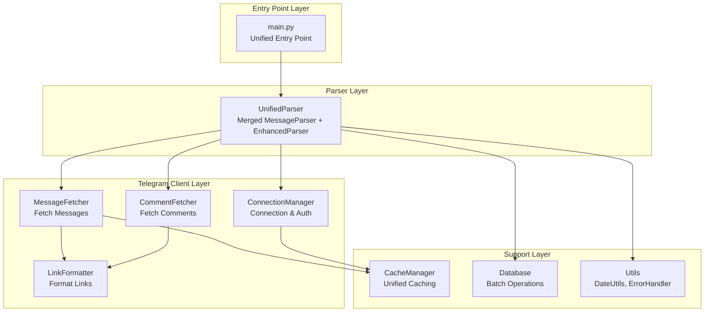
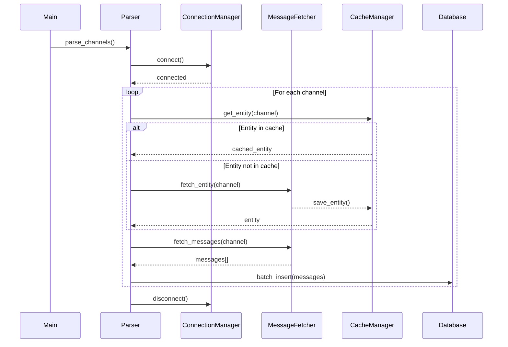
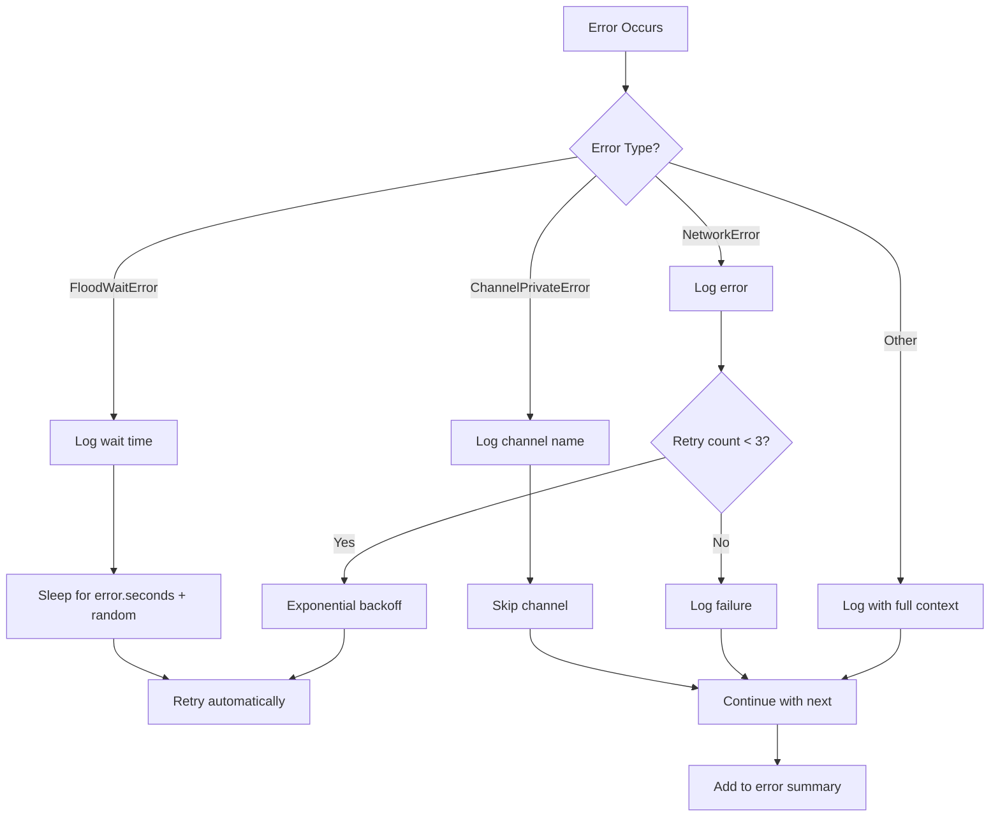

# Design Document: Telegram Parser Refactoring

## Overview

Данный документ описывает архитектурное решение для рефакторинга парсера Telegram-каналов. Проект требует глубокой реструктуризации для устранения дублирования кода, соблюдения принципов SOLID, оптимизации производительности и улучшения поддерживаемости.

### Цели рефакторинга

1. **Модульность**: Разделение монолитного TelegramClient (~700 строк) на 6 специализированных компонентов
2. **Унификация**: Объединение дублирующихся парсеров (MessageParser + EnhancedParser) в единый модуль
3. **Единая точка входа**: Консолидация main.py и enhanced_main.py
4. **Оптимизация**: Батчинг операций БД, оптимизация задержек, унификация кэширования
5. **Качество кода**: Соблюдение лимита 350 строк на модуль, устранение дублирования

### Ключевые принципы

- **Single Responsibility Principle**: Каждый модуль отвечает за одну задачу
- **DRY (Don't Repeat Yourself)**: Устранение всего дублирования кода
- **Separation of Concerns**: Четкое разделение слоев (connection, fetching, caching, parsing)
- **Performance First**: Оптимизация без ущерба читаемости

## Architecture

### High-Level Architecture



### Component Interaction Flow



### New Directory Structure

```
src/
├── main.py                          # Unified entry point (NEW)
├── config.py                        # Centralized configuration
├── core/
│   └── unified_parser.py           # Merged MessageParser + EnhancedParser (NEW)
├── telegram/
│   ├── connection_manager.py       # Connection & authentication (NEW)
│   ├── message_fetcher.py          # Message fetching logic (NEW)
│   ├── comment_fetcher.py          # Comment fetching logic (NEW)
│   ├── link_formatter.py           # Link formatting utilities (NEW)
│   └── auth.py                     # Authentication (existing)
├── cache/
│   └── cache_manager.py            # Unified cache management (NEW)
├── database/
│   └── models.py                   # Database with batch operations (UPDATED)
├── utils/
│   ├── date_utils.py               # Date parsing and formatting (NEW)
│   ├── error_handler.py            # Centralized error handling (NEW)
│   ├── logger.py                   # Logging (existing)
│   └── channels_loader.py          # Channel loading (existing)
└── export/
    ├── google_docs.py              # Google Docs export (existing)
    └── advanced_export.py          # Advanced export (existing)
```

## Components and Interfaces

### 1. Unified Entry Point (main.py)

**Назначение**: Единая точка входа, объединяющая функциональность main.py и enhanced_main.py

**Интерфейс**:
```python
async def main():
    """Главная функция с поддержкой всех режимов"""
    
def parse_arguments() -> argparse.Namespace:
    """Парсинг аргументов командной строки"""
    
async def run_parse_mode(args) -> bool:
    """Режим парсинга каналов"""
    
async def run_export_mode(args) -> bool:
    """Режим экспорта данных"""
    
async def run_stats_mode(args) -> bool:
    """Режим статистики"""
    
async def run_schedule_mode(args) -> bool:
    """Режим планировщика"""
```

**Зависимости**:
- `core.unified_parser.UnifiedParser`
- `utils.logger`
- `config`

**Размер**: ~200 строк

---

### 2. UnifiedParser (core/unified_parser.py)

**Назначение**: Объединенный парсер с полной функциональностью обоих предыдущих парсеров

**Интерфейс**:
```python
class UnifiedParser:
    async def init_async() -> None:
        """Асинхронная инициализация"""
    
    async def parse_channels(channel_links: Set[str]) -> Dict[str, List[Message]]:
        """Парсинг списка каналов"""
    
    async def parse_channel(channel_link: str) -> List[Message]:
        """Парсинг одного канала с retry логикой"""
    
    async def export_to_google_docs(messages: List[Dict]) -> None:
        """Экспорт в Google Docs"""
    
    def get_statistics() -> Dict:
        """Получение статистики"""
    
    def setup_scheduler() -> None:
        """Настройка планировщика"""
```

**Зависимости**:
- `telegram.connection_manager.ConnectionManager`
- `telegram.message_fetcher.MessageFetcher`
- `database.models.Database`
- `cache.cache_manager.CacheManager`
- `utils.error_handler.ErrorHandler`

**Размер**: ~350 строк

---

### 3. ConnectionManager (telegram/connection_manager.py)

**Назначение**: Управление подключением и авторизацией в Telegram

**Интерфейс**:
```python
class ConnectionManager:
    async def connect() -> None:
        """Подключение к Telegram API"""
    
    async def disconnect() -> None:
        """Отключение от Telegram API"""
    
    def is_connected() -> bool:
        """Проверка статуса подключения"""
    
    async def ensure_authorized() -> bool:
        """Проверка авторизации"""
    
    def get_client() -> TelethonClient:
        """Получение клиента Telethon"""
```

**Зависимости**:
- `telethon.TelegramClient`
- `config`
- `utils.logger`

**Размер**: ~150 строк

---

### 4. MessageFetcher (telegram/message_fetcher.py)

**Назначение**: Получение сообщений из каналов с оптимизацией

**Интерфейс**:
```python
class MessageFetcher:
    async def fetch_channel_messages(
        channel_link: str, 
        start_date: datetime, 
        end_date: datetime
    ) -> List[Message]:
        """Получение сообщений из канала"""
    
    async def fetch_messages_batch(
        channel_links: Set[str],
        start_date: datetime,
        end_date: datetime
    ) -> Dict[str, List[Message]]:
        """Пакетное получение сообщений"""
    
    async def get_entity_lazy(channel_link: str) -> Any:
        """Ленивое получение entity из первого сообщения"""
    
    async def prefetch_entities(channel_links: Set[str]) -> None:
        """Предзагрузка entity батчами (опционально)"""
```

**Зависимости**:
- `telegram.connection_manager.ConnectionManager`
- `telegram.link_formatter.LinkFormatter`
- `cache.cache_manager.CacheManager`
- `utils.date_utils.DateUtils`
- `utils.error_handler.ErrorHandler`

**Размер**: ~350 строк

---

### 5. CommentFetcher (telegram/comment_fetcher.py)

**Назначение**: Получение комментариев к постам

**Интерфейс**:
```python
class CommentFetcher:
    async def fetch_post_comments(
        channel: Any,
        message: Any,
        max_comments: int = 50
    ) -> List[Comment]:
        """Получение комментариев к посту"""
    
    async def fetch_discussion_comments(
        linked_chat_id: int,
        message_id: int,
        max_comments: int
    ) -> List[Comment]:
        """Получение комментариев из discussion chat"""
    
    async def fetch_channel_comments(
        channel: Any,
        message_id: int,
        max_comments: int
    ) -> List[Comment]:
        """Получение комментариев из самого канала"""
    
    async def find_previous_post(message: Any, text: str) -> Optional[str]:
        """Поиск ссылки на предыдущий пост"""
```

**Зависимости**:
- `telegram.connection_manager.ConnectionManager`
- `telegram.link_formatter.LinkFormatter`
- `config`
- `utils.logger`

**Размер**: ~200 строк

---

### 6. LinkFormatter (telegram/link_formatter.py)

**Назначение**: Форматирование ссылок на сообщения и комментарии

**Интерфейс**:
```python
class LinkFormatter:
    @staticmethod
    def format_message_link(
        channel_link: str,
        channel_entity: Any,
        message_id: int
    ) -> Optional[str]:
        """Форматирование ссылки на сообщение"""
    
    @staticmethod
    def format_comment_link(
        channel_entity: Any,
        message_id: int,
        comment_id: int,
        is_discussion: bool = False
    ) -> Optional[str]:
        """Форматирование ссылки на комментарий"""
    
    @staticmethod
    def format_private_channel_id(channel_id: int) -> str:
        """Форматирование ID приватного канала"""
    
    @staticmethod
    def extract_username(channel_link: str) -> str:
        """Извлечение username из ссылки"""
    
    @staticmethod
    def validate_link(link: str) -> bool:
        """Валидация ссылки"""
```

**Зависимости**: Нет (утилитарный модуль)

**Размер**: ~100 строк

---

### 7. CacheManager (cache/cache_manager.py)

**Назначение**: Унифицированное управление кэшем (entity + processed links)

**Интерфейс**:
```python
class CacheManager:
    # Entity cache
    async def get_entity(channel_link: str) -> Optional[Any]:
        """Получение entity из кэша"""
    
    async def save_entity(channel_link: str, entity: Any) -> None:
        """Сохранение entity в кэш"""
    
    def is_entity_valid(channel_link: str) -> bool:
        """Проверка актуальности entity"""
    
    # Processed links cache
    def get_processed_links() -> Set[str]:
        """Получение обработанных ссылок"""
    
    def add_processed_link(link: str) -> None:
        """Добавление обработанной ссылки"""
    
    # General cache operations
    async def load() -> None:
        """Загрузка кэша из файла"""
    
    async def save() -> None:
        """Сохранение кэша в файл"""
    
    def clear() -> None:
        """Очистка кэша"""
```

**Зависимости**:
- `config`
- `utils.logger`

**Размер**: ~200 строк

---

### 8. DateUtils (utils/date_utils.py)

**Назначение**: Утилиты для работы с датами

**Интерфейс**:
```python
class DateUtils:
    @staticmethod
    def get_date_range(days: Optional[int] = None) -> Tuple[datetime, datetime]:
        """Получение диапазона дат из конфигурации или по количеству дней"""
    
    @staticmethod
    def parse_date_from_config(date_str: str) -> datetime:
        """Парсинг даты из конфигурации (DD-MM-YYYY)"""
    
    @staticmethod
    def to_utc(dt: datetime) -> datetime:
        """Конвертация в UTC"""
    
    @staticmethod
    def format_date(dt: datetime, format: str = '%Y-%m-%d %H:%M:%S') -> str:
        """Форматирование даты"""
```

**Зависимости**:
- `config`

**Размер**: ~80 строк

---

### 9. ErrorHandler (utils/error_handler.py)

**Назначение**: Централизованная обработка ошибок

**Интерфейс**:
```python
class ErrorHandler:
    def __init__(self):
        self.errors: List[ErrorRecord] = []
    
    async def handle_flood_wait(error: FloodWaitError, context: str) -> None:
        """Обработка FloodWaitError с автоматическим retry"""
    
    def handle_channel_error(error: Exception, channel: str) -> None:
        """Обработка ошибок канала (private, not found)"""
    
    async def handle_network_error(
        error: Exception,
        retry_func: Callable,
        max_retries: int = 3
    ) -> Any:
        """Обработка сетевых ошибок с exponential backoff"""
    
    def log_error(error: Exception, context: Dict) -> None:
        """Логирование ошибки с контекстом"""
    
    def get_error_summary() -> Dict:
        """Получение сводки по ошибкам"""
```

**Зависимости**:
- `utils.logger`

**Размер**: ~150 строк

---

### 10. Database (database/models.py) - UPDATED

**Назначение**: Работа с БД с поддержкой батчинга

**Новые методы**:
```python
class Database:
    def batch_insert_messages(messages: List[Message], batch_size: int = 100) -> int:
        """Пакетная вставка сообщений"""
    
    def begin_transaction() -> None:
        """Начало транзакции"""
    
    def commit_transaction() -> None:
        """Коммит транзакции"""
    
    def rollback_transaction() -> None:
        """Откат транзакции"""
```

**Размер**: ~350 строк (добавлено ~50 строк)

## Data Models

### Message Model

```python
@dataclass
class Message:
    """Модель сообщения из канала"""
    date: datetime
    text: str
    link: str
    title: str = ''
    previous_post: Optional[str] = None
    comments: List[Comment] = field(default_factory=list)
    
    # Дополнительные поля для БД
    channel: str = ''
    message_id: int = 0
    author: str = ''
    views: int = 0
    forwards: int = 0
    replies: int = 0
    media_type: str = ''
    media_url: str = ''
```

### Comment Model

```python
@dataclass
class Comment:
    """Модель комментария к посту"""
    author: str
    link: str
    text: str
    date: Optional[datetime] = None
```

### ErrorRecord Model

```python
@dataclass
class ErrorRecord:
    """Запись об ошибке"""
    timestamp: datetime
    error_type: str
    error_message: str
    context: Dict[str, Any]
    channel: Optional[str] = None
    message_id: Optional[int] = None
```

### CacheEntry Model

```python
@dataclass
class CacheEntry:
    """Запись в кэше entity"""
    entity: Any
    cached_at: datetime
    channel_id: int
    title: str
    username: str
```

## Error Handling

### Error Handling Strategy



### Error Context

Каждая ошибка логируется с полным контекстом:
- Timestamp
- Channel name
- Message ID (если применимо)
- Error type
- Error message
- Stack trace

### Error Summary Report

В конце сессии парсинга генерируется отчет:
```python
{
    'total_errors': 15,
    'flood_wait_errors': 3,
    'channel_errors': 5,
    'network_errors': 2,
    'other_errors': 5,
    'failed_channels': ['channel1', 'channel2'],
    'details': [...]
}
```

## Testing Strategy

### Unit Tests

**Модули для тестирования**:
1. `LinkFormatter` - форматирование ссылок
   - Публичные каналы
   - Приватные каналы
   - Комментарии
   - Валидация

2. `DateUtils` - работа с датами
   - Парсинг из конфигурации
   - Расчет диапазонов
   - Конвертация в UTC

3. `CacheManager` - управление кэшем
   - Сохранение/загрузка
   - Валидация актуальности
   - Очистка

4. `ErrorHandler` - обработка ошибок
   - FloodWait retry
   - Exponential backoff
   - Error logging

5. `Database` - батчинг операций
   - Batch insert
   - Transaction management
   - Rollback on error

### Integration Tests

1. **Парсинг тестовых каналов**
   - 3+ публичных канала
   - Проверка получения сообщений
   - Проверка форматирования ссылок

2. **Обработка ошибок**
   - FloodWait с автоматическим retry
   - Приватные/недоступные каналы
   - Сетевые ошибки

3. **Экспорт в Google Docs**
   - Экспорт полученных сообщений
   - Проверка форматирования

4. **Кэширование**
   - Сохранение entity
   - Загрузка из кэша
   - Валидация актуальности

### Performance Tests

1. **Батчинг БД**
   - Сравнение времени: individual vs batch insert
   - Проверка целостности данных

2. **Оптимизация задержек**
   - Измерение времени парсинга до/после
   - Проверка соблюдения rate limits

3. **Ленивая загрузка entity**
   - Сравнение: prefetch vs lazy loading
   - Количество API запросов

### Test Coverage Goals

- Unit tests: 80%+ coverage
- Integration tests: все критические пути
- Performance tests: baseline + оптимизация

## Migration Strategy

### Phase 1: Preparation (Day 1)

1. **Создание новой структуры директорий**
   ```bash
   mkdir -p src/telegram src/cache src/core
   ```

2. **Создание утилитарных модулей** (независимые, без зависимостей)
   - `utils/date_utils.py`
   - `telegram/link_formatter.py`
   - `utils/error_handler.py`

3. **Написание unit tests для утилит**

### Phase 2: Core Refactoring (Day 2-3)

4. **Разделение TelegramClient**
   - Создать `telegram/connection_manager.py`
   - Создать `telegram/message_fetcher.py`
   - Создать `telegram/comment_fetcher.py`
   - Перенести логику из `src/telegram/client.py`

5. **Унификация кэширования**
   - Создать `cache/cache_manager.py`
   - Мигрировать entity cache
   - Мигрировать processed links cache
   - Удалить дублирующиеся файлы кэша

6. **Оптимизация БД**
   - Добавить batch_insert в `database/models.py`
   - Добавить transaction management

### Phase 3: Parser Unification (Day 4)

7. **Объединение парсеров**
   - Создать `core/unified_parser.py`
   - Перенести логику из `MessageParser`
   - Перенести логику из `EnhancedParser`
   - Устранить дублирование

8. **Создание единой точки входа**
   - Создать новый `main.py`
   - Перенести функциональность из обоих main файлов
   - Добавить поддержку всех режимов

### Phase 4: Optimization (Day 5)

9. **Оптимизация задержек**
   - Уменьшить задержки между сообщениями
   - Уменьшить задержки между комментариями
   - Добавить adaptive delay

10. **Обновление зависимостей**
    - Обновить `requirements.txt`
    - Тестировать совместимость

### Phase 5: Testing & Cleanup (Day 6-7)

11. **Комплексное тестирование**
    - Unit tests
    - Integration tests
    - Performance tests

12. **Очистка**
    - Удалить старые файлы:
      - `main.py` (старый)
      - `enhanced_main.py`
      - `src/telegram/client.py`
      - `src/parsers/message_parser.py`
      - `src/core/enhanced_parser.py`
      - `cache/entity_cache.pkl`
      - `cache/entity_metadata.json`
    
13. **Финальная проверка**
    - Все модули < 350 строк
    - Нет дублирования кода
    - Все тесты проходят

### Rollback Plan

На каждом этапе:
1. Коммит в git перед изменениями
2. Сохранение старых файлов с суффиксом `.old`
3. Возможность быстрого отката через `git revert`

### Validation Checklist

После завершения миграции проверить:

- [ ] Единая точка входа (`main.py`)
- [ ] Все модули ≤ 350 строк
- [ ] Нет дублирования кода
- [ ] Унифицированное кэширование
- [ ] Батчинг операций БД
- [ ] Оптимизированные задержки
- [ ] Централизованная обработка ошибок
- [ ] Обновленные зависимости
- [ ] Все тесты проходят
- [ ] Парсинг 3+ каналов работает
- [ ] Экспорт в Google Docs работает
- [ ] Старые файлы удалены

## Performance Optimizations

### 1. Database Batching

**До**:
```python
for message in messages:
    db.add_message(message)  # 1000 сообщений = 1000 INSERT
```

**После**:
```python
db.batch_insert_messages(messages, batch_size=100)  # 1000 сообщений = 10 batch INSERT
```

**Ожидаемый прирост**: 5-10x быстрее для больших объемов

### 2. Delay Optimization

**До**:
```python
await asyncio.sleep(0.1)  # между каждым сообщением
await asyncio.sleep(0.5)  # между каждым комментарием
```

**После**:
```python
await asyncio.sleep(0.01)  # между сообщениями (10x быстрее)
await asyncio.sleep(0.1)   # между комментариями (5x быстрее)
```

**Ожидаемый прирост**: 30-40% сокращение времени парсинга

### 3. Lazy Entity Loading

**До**:
```python
# Предзагрузка всех entity перед парсингом
for channel in channels:
    entity = await client.get_entity(channel)  # N API calls
```

**После**:
```python
# Entity извлекается из первого сообщения
async for msg in client.iter_messages(channel):
    entity = msg._chat  # 0 дополнительных API calls
```

**Ожидаемый прирост**: Устранение N лишних API запросов

### 4. Unified Caching

**До**:
```python
# Дублирование: entity_cache.pkl + cache.json
entity_cache = pickle.load('entity_cache.pkl')
processed_links = json.load('cache.json')
```

**После**:
```python
# Единый кэш-менеджер
cache = CacheManager()
await cache.load()  # Загружает все данные
```

**Ожидаемый прирост**: Упрощение, меньше I/O операций

## Configuration Updates

### New Configuration Parameters

```json
{
  "TELEGRAM": {
    "DELAY_BETWEEN_MESSAGES": 0.01,
    "DELAY_BETWEEN_COMMENTS": 0.1,
    "ADAPTIVE_DELAY": true,
    "LAZY_ENTITY_LOADING": true,
    "PREFETCH_ENTITIES": false
  },
  "DATABASE": {
    "BATCH_SIZE": 100,
    "USE_TRANSACTIONS": true
  },
  "CACHE": {
    "ENTITY_MAX_AGE_DAYS": 7,
    "AUTO_SAVE_INTERVAL": 10
  },
  "ERROR_HANDLING": {
    "MAX_RETRIES": 3,
    "EXPONENTIAL_BACKOFF_BASE": 2,
    "LOG_FULL_CONTEXT": true
  }
}
```

## Conclusion

Данный дизайн обеспечивает:

1. **Модульность**: 10 специализированных модулей вместо 3 монолитных
2. **Читаемость**: Все модули ≤ 350 строк
3. **Производительность**: Батчинг БД, оптимизация задержек, ленивая загрузка
4. **Поддерживаемость**: Устранение дублирования, единая точка входа, централизованная обработка ошибок
5. **Тестируемость**: Четкое разделение ответственности, изолированные компоненты

Рефакторинг займет 6-7 дней с учетом тестирования и будет выполнен поэтапно с возможностью отката на каждом шаге.
